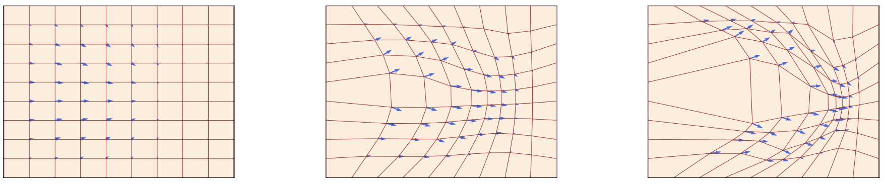
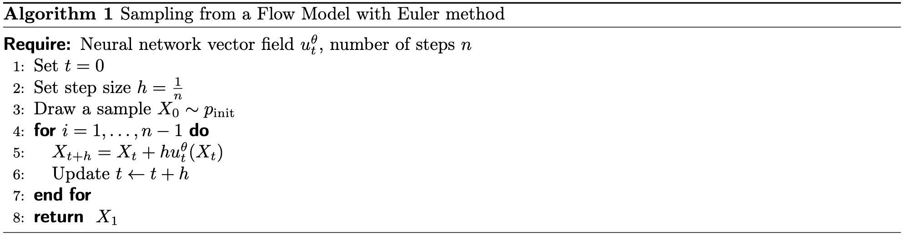
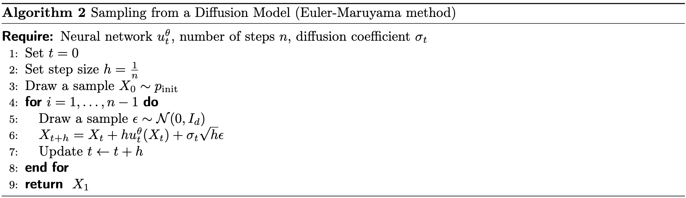

# Flow and Diffusion Models

## 流模型 Flow Models

### 定义 ODE

首先，我们从定义 ODE (ordinary differential equations) 开始。ODE 的一个解被定义为 **轨迹** (trajectory)，它具有以下形式：

$$
X:[0,1]\to\mathbb{R}^d,\quad t\mapsto X_t
$$

它表示了从时间 $t$ 到空间 $\mathbb{R}^d$ 中某一位置的映射。

!!! info "轨迹 (trajectory)"

    可以把轨迹理解为物体随时间变化的路径。想象一个在空间中运动的小球，$X_t$ 描述了小球在 $t$ 时刻所处的位置。而在生成模型的背景下，这个“空间”是一个非常高维度的空间（例如，一张图片的所有像素值构成的空间），而“点”就是我们要生成的对象（例如，一张图片） 。

每个 ODE 都被一个向量场 $u$ (vector field) 定义，它具有以下形式：

$$
u:\mathbb{R}^d\times[0,1]\to\mathbb{R}^d,\quad(x,t)\mapsto u_t(x)
$$

即对于任意时间 $t$ 和任意位置 $x$，我们都能取得一个向量 $u_t(x)\in\mathbb{R}^d$，它表示了空间中的一个速度。

!!! info "向量场 (vector field)"

    可以通过分别固定 $t$ 和 $x$ 的方式来理解：

    - **固定 $t$**：得到一个在 $\mathbb{R}^d$ 上的向量场。
    - **固定 $x$**：看到这个点随时间 $t$ 的演化速度如何变化。

我们可以用一个 ODE 方程来约束一条轨迹：

$$
\begin{align*}
\frac{d}{dt} X_t &= u_t(X_t) \quad &&\blacktriangleright \text{ODE} \\
X_0 &= x_0 \quad &&\blacktriangleright \text{initial conditions}
\end{align*}
$$

它描述了粒子的位置 $X_t$ 会沿着时间变化的向量场 $u_t$ 进行流动。具体地：

- 在每一个时刻 $t$，系统都有一个“速度场” $u_t(x)$；
- 给定当前粒子位置 $X_t$，用向量场 $u_t(X_t)$ 计算其导数（速度）；
- 这个速度告诉我们下一刻 $X_t$ 会往哪里走；
- 把所有 $t \in [0,1]$ 组合起来，得到一条轨迹 $X_t$。

接下来，我们可能提出这样一个问题：如果我们在 $t=0$ 时刻从 $X_0=x_0$ 出发，那么 $t$ 时刻我们在哪（即求 $X_t$ 的值）。而这个问题可以用如下的**流 (flow)** 来描述，它是 ODE 方程的一个解：

$$
\begin{align*}
\psi : \mathbb{R}^d \times [0,1] &\mapsto \mathbb{R}^d, \quad (x_0, t) \mapsto \psi_t(x_0) \\
\frac{d}{dt} \psi_t(x_0) &= u_t(\psi_t(x_0)) \quad &&\blacktriangleright \text{flow ODE} \\
\psi_0(x_0) &= x_0 \quad &&\blacktriangleright \text{flow initial conditions}
\end{align*}
$$

当给定 $X_0=x_0$，ODE 的一条轨迹可以由 $X_t=\psi_t(X_0)$ 得到。因此，我们容易发现向量场、常微分方程、流之间的关系：

> vector fields define ODEs whose solutions are flows.

另外，为了数学上的严谨性，有定理证明：**每一个 ODE 都有且仅有一个 flow 与之对应**。由于我们在实际应用中通常把它当作已知结论，在此略去不表。

??? note "线性向量场的一个🌰"

    让我们考虑一个简单的向量场 $u_t(x)$，它是关于 $x$ 的一个线性函数，即：$u_t(x) = -\theta x,\quad \theta > 0$，那么函数：$\psi_t(x_0) = \exp(-\theta t)\, x_0 \tag{3}$ 定义了一个流（flow）$\psi$，它满足我们要求的微分方程（ODE）。

    结果验证：

    $$
    \begin{align*}
    \psi_0(x_0) &= x_0 \\
    \frac{d}{dt} \psi_t(x_0)  = \frac{d}{dt} \left( \exp(-\theta t)\, x_0 \right)  = &-\theta \exp(-\theta t)\, x_0  = -\theta \psi_t(x_0) = u_t(\psi_t(x_0))
    \end{align*}
    $$

### 如何模拟一个 ODE？

在通常情况下，我们并不能直接计算得到 $\psi_t$，但有一些数值计算的方法可以帮助我们近似计算它，例如欧拉方法 (Euler method)，我们初始化 $X_0=x_0$ 并应用以下方程：

$$
X_{t+h}=X_t+hu_t(X_t)\quad(t=0,h,2h,3h,\ldots,1-h)
$$

其中，步长 $h=n^{-1}\gt0$ 是一个超参数。

接下来，我们就可以用 ODE 来构建一个生成式模型了。在生成式模型中，我们的目标是实现从简单分布 $p_{init}$ 到复杂分布 $p_{data}$ 的转换，这种转换很自然可以联想到使用 ODE 来解决。我们可以用如下的 ODE 来描述**流模型**：

$$
\begin{align*}
X_0 &\sim p_{\text{init}} && \blacktriangleright \text{ random initialization} \\
\frac{d}{dt}X_t &= u_t^{\theta}(X_t) && \blacktriangleright \text{ ODE}
\end{align*}
$$

其中，$u_t^\theta$ 是一个神经网络，$\theta$ 是网络参数。现在，我们把它理解成一个从 $\mathbb{R}^d\times[0,1]\rightarrow\mathbb{R}^d$  的连续函数即可。我们的**目标**是在轨迹的终点 (即 $X_1$) 生成期待的分布 $p_{data}$，相当于：

$$
X_1 \sim p_{\text{data}} \iff \psi_1^{\theta}(X_0) \sim p_{\text{data}}
$$

尽管我们把这个模型称为 flow model，但是**神经网络参数化的内容是向量场，而不是流**。如果我们要计算流，仍然需要模拟这个 ODE 才能得到整个 flow。下面，我们给出从 flow model 进行采样的算法：

## 扩散模型 Diffusion Models

SDE (stochastic differential equations) 是 ODE 的推广，在 ODE 的基础上加入了随机 (stochastic) 轨迹。一条随机轨迹通常被称为一个**随机过程**：

$$
\begin{align*}
&X_t \text{ is a random variable for every } 0 \le t \le 1 \\
&X : [0, 1] \to \mathbb{R}^d, \quad t \mapsto X_t \text{ is a random trajectory for every draw of } X
\end{align*}
$$

当我们执行同一个随机过程两次，可能得到不一样的结果，因为每一次的值都是动态变化的。

### 布朗运动

SDE（随机微分方程）是通过布朗运动构建的——这是一个源于对物理扩散过程的研究而产生的基础随机过程。我们可以将布朗运动看作是一个连续的随机游走。

下面，我们来定义它：一个布朗运动 $W = (W_t)_{0 \le t \le 1}$ 是一个随机过程，它满足 $W_0 = 0$，其轨迹 $t \mapsto W_t$ 是连续的，并且满足以下两个条件：

1. **正态增量**：对于所有 $0 \le s < t$，有 $W_t - W_s \sim \mathcal{N}(0, (t-s)I_d)$，即，增量服从高斯分布，其方差随时间线性增加（$I_d$ 是单位矩阵）。
2. **独立增量**：对于任何 $0 \le t_0 < t_1 < \dots < t_n = 1$，增量 $W_{t_1} - W_{t_0}, \dots, W_{t_n} - W_{t_{n-1}}$ 是相互独立的随机变量。

布朗运动也称为**维纳过程**（Wiener process），这就是为什么我们用字母“W”来表示它。我们可以通过设置步长 $h > 0$，令 $W_0 = 0$ 并通过以下公式更新，从而轻松地近似模拟一个布朗运动：

$$
W_{t+h} = W_t + \sqrt{h}\epsilon_t, \quad \epsilon_t \sim \mathcal{N}(0, I_d) \quad (t = 0, h, 2h, \dots, 1-h)
$$

### 从 ODE 到 SDE

随机微分方程（SDE）的核心思想是在常微分方程（ODE）的确定性基础上，通过加入一个由布朗运动驱动的随机动态来进行扩展。由于一切都是随机的，我们便无法再进行求导，我们需要找到一种**不使用导数的等价表述形式**。

我们首先对上面提到的 ODE 方程进行等价改写：

$$
\begin{align*}
\frac{d}{dt}X_t &= u_t(X_t) &&\blacktriangleright \text{ expression via derivatives} \\[1.5em]
\stackrel{(i)}{\iff}  \frac{1}{h}(X_{t+h} - X_t) &= u_t(X_t) + R_t(h) \\[1.5em]
\qquad \implies X_{t+h} &= X_t + h u_t(X_t) + h R_t(h) &&\blacktriangleright \text{ expression via infinitesimal updates}
\end{align*}
$$

因此，我们可以用一种新的视角来理解 ODE 和 SDE 规约下的轨迹：ODE 下的轨迹就是在每个时间戳向 $u_t(X_t)$ 方向走一小步；SDE 下的轨迹就是**在这个基础上再加上布朗运动的贡献**：

$$
X_{t+h} = X_t + \underbrace{h u_t(X_t)}_{\text{deterministic}} + \underbrace{\sigma_t (W_{t+h} - W_t)}_{\text{stochastic}} + \underbrace{h R_t(h)}_{\text{error term}}
$$

其中，$\sigma_t\geq0$ 描述了 diffusion coefficient，$R_t(h)$ 描述了随机误差。更常见地，我们给出如下形式化描述：

$$
\begin{align*}
    dX_t &= u_t(X_t)dt + \sigma_t dW_t && \blacktriangleright \text{ SDE} \\
    X_0 &= x_0 && \blacktriangleright \text{ initial condition}
\end{align*}
$$

### 如何模拟一个 SDE？

和 ODE 类似，我们也有相应的数值方法来模拟 SDE。其中，我们只需要感性地来理解 Euler-Maruyama method，它可以用公式来描述，其中 $X_0=x_0$：

$$
X_{t+h} = X_t + h u_t(X_t) + \sqrt{h}\sigma_t \epsilon_t, \quad \epsilon_t \sim \mathcal{N}(0, I_d)
$$

和 Euler 方法相比，我们发现它只是**多加了一点高斯噪声**。

接下来，基于 SDE 的生成式模型就更容易得到了：

## 总结一下

在接下来的文档中，我们用一个参数为 $\theta$ 的神经网络来描述**扩散生成模型** (diffusion model)，它参数化了 vector field 和 diffusion coefficient $\sigma_t$：

$$
\textbf{Neural network:} \quad u^{\theta}: \mathbb{R}^d \times [0, 1] \to \mathbb{R}^d, \; (x, t) \mapsto u_t^{\theta}(x) \text{ with parameters } \theta \\
\textbf{Fixed:} \quad \sigma_t: [0, 1] \to [0, \infty), \; t \mapsto \sigma_t
$$

而从我们的 SDE 模型中采样得到生成对象的方法如下：

$$
\begin{align*}
    \textbf{Initialization:} \quad & X_0 \sim p_{\text{init}} &&\blacktriangleright \text{ Initialize with simple distribution, e.g. a Gaussian} \\
    \textbf{Simulation:} \quad & dX_t = u_t^{\theta}(X_t)dt + \sigma_t dW_t &&\blacktriangleright \text{ Simulate SDE from 0 to 1} \\
    \textbf{Goal:} \quad & X_1 \sim p_{\text{data}} &&\blacktriangleright \text{ Goal is to make } X_1 \text{ have distribution } p_{\text{data}}
\end{align*}
$$
