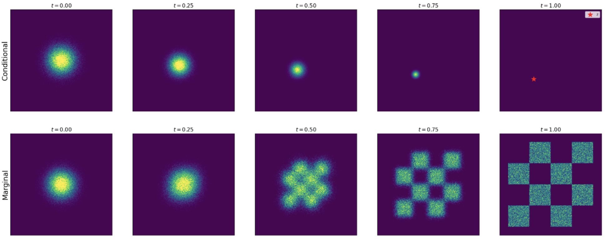
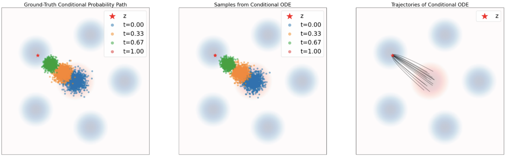

# Constructing a Training Target

???+ warning "预告"

    本节的难度可能很大。只能勉强懂个大概🥵

## 动机

在上一节，我们介绍了如何通过模拟 ODE/SDE 来构建流模型和扩散模型：

$$
\begin{align*}
X_0 \sim p_{\text{init}}, \quad \text{d}X_t = u_t^{\theta}(X_t)\text{d}t \quad &(\text{Flow model}) \\
X_0 \sim p_{\text{init}}, \quad \text{d}X_t = u_t^{\theta}(X_t)\text{d}t + \sigma_t \text{d}W_t \quad &(\text{Diffusion model})
\end{align*}
$$

其中，$u_t^\theta$ 是一个神经网络。接下来的问题在于，我们要如何训练这个神经网络呢？例如，在机器学习中，对于每一个 $u_t^\theta(x)$，我们都需要一个 target 与之对应，然后我们可以用均方误差 (mean-squared error) 来衡量预测值和真实值之间的差距，并把它作为损失函数尝试进行最小化。

$$
\mathcal{L}(\theta) = \| u_t^{\theta}(x) - \underbrace{u_t^{\text{target}}(x)}_{\text{training target}} \|^2
$$

在本节中，我们将聚焦 $u_t^{\text{target}}(x)$，找到与之对应的等式；在下一节中，我们将设计一个训练算法来拟合这个 target. 本节的目标就是为 target 推导出一个公式，使得与之对应的 ODE/SDE 能够把数据分布从 $p_\text{init}$ 转换到 $p_\text{data}$.

## 条件与边际概率路径

**条件概率路径**（conditional probability path）用于描述一个从初始分布到目标点的概率演化路径。

!!! info "一些定义"

    - 对于一个数据点 $z\in\mathbb{R}^d$ ，我们定义 $\delta_z$ 为 狄拉克 (Dirac delta) 分布，从 $\delta_z$ 的采样永远返回 $z$，它表示“确定性分布”，即概率 100% 集中在点 $z$ 上。

    - $p_t(\cdot | z)$：表示**给定最终状态 $z$** 后，在时间 $t \in [0,1]$ 上的**条件概率分布路径**。它是一个以 $t$ 为参数的**条件分布流**（conditional distribution flow）。
    - $p_{\text{init}}$：某个固定的初始分布，比如高斯分布 $\mathcal{N}(0, I)$，表示“无信息状态”或“起点”。

一个条件概率路径是在 $\mathbb{R}^d$ 上的一组分布 $p_t(x|z)$，它满足：

$$
p_0(\cdot|z) = p_{\text{init}}, \quad p_1(\cdot|z) = \delta_z \quad \text{for all } z \in \mathbb{R}^d.
$$

!!! info "如何理解这些条件"

    第一个条件：$p_0(\cdot | z) = p_{\text{init}}$​，它表示在时间 $t = 0$ 时，不管最终我们想达到什么点 $z$，**初始分布总是固定的** $p_{\text{init}}$。也就是说，我们从相同的随机分布起步。

    第二个条件：$p_1(\cdot | z) = \delta_z$ 意思是在时间 $t = 1$ 时，给定目标点 $z$，我们的条件分布“收敛”为只在 $z$ 上有概率质量的点分布。即，这个路径一定最终走到 $z$。

    这说明**我们可以为每个目标点 $z$ 构造一条从噪声开始最终走到 $z$ 的概率轨迹**。

每个条件概率路径 $p_t(x|z)$ 都可以引出一条边际概率路径 $p_t(x)$：

$$
\begin{align*}
z \sim p_{\text{data}}, \quad x \sim p_t(\cdot|z) \Rightarrow x \sim p_t \quad &\blacktriangleright \text{ sampling from marginal path} \\
p_t(x) = \int p_t(x|z)p_{\text{data}}(z)\text{d}z \quad &\blacktriangleright \text{ density of marginal path}
\end{align*}
$$

!!! info

    首先从数据分布中采样一个真实样本 $z \sim p_{\text{data}}$，然后，从给定这个 $z$ 的条件分布路径中采样 $x \sim p_t(\cdot|z)$，那么，最终得到的 $x$ 的分布就是**边际分布路径** $p_t$。

    我们可以把 $p_t(\cdot|z)$ 看作从 $z$ 发出的一条“模糊轨道”，每个 $z$ 都产生自己的条件路径；所有 $z \sim p_{\text{data}}$ 产生的路径加在一起，构成了 $p_t$。

    而当我们把它用概率密度的方式写出来，可以应用如下公式：

    $$
    p(x) = \int p(x|z)p(z)dz
    $$

这个公式说明：当前时刻 $t$ 上，边际分布 $p_t(x)$ 的形状是所有“从 $z \sim p_{\text{data}}$ 向外扩散的路径”在 $x$ 处的综合叠加。

我们可以这样理解，边际概率路径 $p_t$ 事实上就是在 $p_\text{init}$ 和 $p_\text{data}$ 上的插值：

$$
p_0 = p_{\text{init}} \quad \text{and} \quad p_1 = p_{\text{data}}. \quad \blacktriangleright \text{ noise-data interpolation}
$$

!!! note "高斯条件概率路径"

    高斯概率路径就是去噪扩散模型 (denoising diffusion models) 使用的概率路径。我们定义 $\alpha_t, \beta_t$ 为噪声调度器，这是两个连续可微的单调函数，并满足 $\alpha_0=\beta_1=0, \alpha_1=\beta_0=1$。然后我们定义条件概率路径如下：

    $$
    p_t(\cdot|z) = \mathcal{N}(\alpha_t z, \beta_t^2 I_d) \quad \blacktriangleright \text{ Gaussian conditional path}
    $$

    我们发现，它满足我们之前对条件概率路径的要求：

    $$
    p_0(\cdot|z) = \mathcal{N}(\alpha_0 z, \beta_0^2 I_d) = \mathcal{N}(0, I_d), \quad \text{and} \quad p_1(\cdot|z) = \mathcal{N}(\alpha_1 z, \beta_1^2 I_d) = \delta_z
    $$

    接下来，我们可以用以下方式进行采样：

    $$
    z \sim p_{\text{data}}, \quad \epsilon \sim p_{\text{init}} = \mathcal{N}(0, I_d) \Rightarrow x = \alpha_t z + \beta_t \epsilon \sim p_t \quad \blacktriangleright \text{ sampling from marginal Gaussian path}
    $$

    在越接近 $t=0$ 的地方，这个过程加入的噪声更多，直到我们只剩下噪声。我们可以从下图直观地感受到条件概率路径和边际概率路径在高斯分布下的采样过程：

    

## 条件与边际向量场

首先，我们定义条件向量场 (conditional vector field) $u_t^{\text{target}}(\cdot|z)$。它是为一个单一的数据点 $z$ 服务的向量场，它的作用是驱动一个从初始噪声分布 $p_\text{init}$ 出发的 ODE，让它在时间 $t$ 的分布恰好为前面定义的条件概率路径 $p_t(\cdot|z)$. 我们可以用如下的形式化方式来表示条件向量场：

$$
X_0 \sim p_{\text{init}}, \quad \frac{\text{d}}{\text{d}t}X_t = u_t^{\text{target}}(X_t|z) \quad \Rightarrow \quad X_t \sim p_t(\cdot|z) \quad (0 \le t \le 1).
$$

!!! note "高斯概率路径的目标 ODE"

    接下来，我们给出高斯概率路径下的向量场，作为理解上述内容的一个例子。如上一个例子中定义的 $\alpha_t, \beta_t$，我们可以得到（其中 $\dot{\alpha}_t = \partial_t \alpha_t$，$\dot{\beta}_t = \partial_t \beta_t$）：

    $$
    u_t^{\text{target}}(x|z) = \left( \dot{\alpha}_t - \frac{\dot{\beta}_t}{\beta_t}\alpha_t \right) z + \frac{\dot{\beta}_t}{\beta_t}x
    $$

    我们可以用这个向量场定义的 ODE 来模拟轨迹，它和实际的条件概率路径是相符合的。

    

接下来，我们介绍**边际化技巧**。根据上述的条件向量场 $u_t^{\text{target}}(\cdot|z)$，我们可以用如下公式计算边际向量场 $u_t^{\text{target}}(x)$ ：

$$
u_t^{\text{target}}(x) = \int u_t^{\text{target}}(x|z) \frac{p_t(x|z)p_{\text{data}}(z)}{p_t(x)} \text{d}z
$$

得到的向量场拥有如下性质：

$$
X_0 \sim p_{\text{init}}, \quad \frac{\text{d}}{\text{d}t}X_t = u_t^{\text{target}}(X_t) \quad \Rightarrow \quad X_t \sim p_t \quad (0 \le t \le 1)
$$

在这里，我们不给出具体的证明（~~其实我也没看懂，所以给不出~~），而是解释这个定理的意义。

!!! info "如何理解边际化技巧"

    我们的 training target 是 $u_t^{\text{target}}$，它实现从噪声 $p_{\text{init}}$ 到真实数据 $p_{\text{data}}$ 的转换。

    而边际向量场本身是很难直接得到的，相对而言，条件向量场是可以通过简单计算得到的。这个定理帮助我们完成了**从条件向量场到边际向量场**的转换，即我们只需要找到满足条件的条件向量场，就能计算得到与之对应的边际向量场。

!!! info "连续性方程 (continuity equation)"

    如果要从数学上严格证明边际化技巧，我们需要用到**连续性方程**。

    它描述了在一个向量场的作用下，概率密度的变化与该向量场的散度（divergence）之间的关系 。

    $$
    \partial_t p_t(x) = -\text{div}(p_t u_t^{\text{target}})(x) \quad \text{for all } x \in \mathbb{R}^d, 0 \le t \le 1.
    $$

    具体内容暂时省略。

## 条件和边际得分函数

接下来，我们要把为流模型（ODE）建立的框架**扩展到随机性更强的扩散模型（SDE）**，利用 SDE 扩展技巧，把上面的 training target $u_t^{\text{target}}$ 扩展到 SDE，构造出一个遵循相同概率路径的 SDE。

为了实现这一点，我们首先介绍得分函数 (score function)：

$$
\nabla \log p_t(x)
$$

如上则为我们需要的得分函数，但是这是边际得分函数，和上面类似，直接计算得到它是比较困难的，因此我们希望能把它和条件得分函数建立联系，其中后者更容易直接得到。

!!! note "一个条件得分函数的🌰"

    在这里，我们依旧以高斯概率路径为例，计算得到它的得分函数。对于高斯路径 $p_t(x|z) = \mathcal{N}(x; \alpha_t z, \beta_t^2 I_d)$，我们代入它的高斯密度函数即可得到：

    $$
    \nabla \log p_t(x|z) = \nabla \log \mathcal{N}(x; \alpha_t z, \beta_t^2 I_d) = -\frac{x - \alpha_t z}{\beta_t^2}.
    $$

接下来，我们推导条件和边际得分函数之间的关系。其中，我们需要用到 $\log$ 函数的求导公式 $\nabla \log f(x)=\frac{\nabla f(x)}{x}$：

$$
\nabla \log p_t(x) = \frac{\nabla p_t(x)}{p_t(x)} = \frac{\nabla \int p_t(x|z)p_{\text{data}}(z)\text{d}z}{p_t(x)} = \frac{\int \nabla p_t(x|z)p_{\text{data}}(z)\text{d}z}{p_t(x)} = \int \nabla \log p_t(x|z) \frac{p_t(x|z)p_{\text{data}}(z)}{p_t(x)} \text{d}z
$$

这样一来，我们就建立了两者之间的关系。有了这个铺垫，我们引出下面的定理 **SDE Extention Trick**.

$$
\begin{align*}
X_0 &\sim p_{\text{init}}, \quad \text{d}X_t = \left[ u_t^{\text{target}}(X_t) + \frac{\sigma_t^2}{2}\nabla \log p_t(X_t) \right]\text{d}t + \sigma_t \text{d}W_t \\
\Rightarrow X_t &\sim p_t \quad (0 \le t \le 1)
\end{align*}
$$

!!! info "如何理解这个 trick"

    我们可以这样感性地理解这个公式，当我们在原来的基础上加入了 diffusion 噪声扰动后，需要另外引入一个修正项对我们的 target 进行修正，而这个修正项正是我们刚刚介绍的得分函数。

    对于这个 SDE 满足的分布，特别地，我们可以得到，$X_1\sim p_\text{data}$.

## 总结一下

**流模型（flow）的训练目标是边际向量场 $u_t^{target}$ 。**为了构建它，我们首先选择一个条件概率路径 $p_t(x|z)$，该路径需满足 $p_0(\cdot|z)=p_{init}$ 和 $p_1(\cdot|z)=\delta_z$ 。接下来，我们找到一个条件向量场 $u_t^{flow}(x|z)$，使得其对应的流 $\psi_t^{target}(x|z)$ 满足：

$$
X_0 \sim p_{init} \quad \Rightarrow \quad X_t = \psi_t^{target}(X_0|z) \sim p_t(\cdot|z)
$$

或者等价地，让 $u_t^{target}$ 满足连续性方程。然后，由下式定义的边际向量场：

$$
u_t^{target}(x) = \int u_t^{target}(x|z) \frac{p_t(x|z)p_{data}(z)}{p_t(x)} dz
$$

就能遵循边际概率路径，即：

$$
X_0 \sim p_{init}, \quad dX_t = u_t^{target}(X_t)dt \quad \Rightarrow \quad X_t \sim p_t \quad (0 \le t \le 1)
$$

特别地，对于这个ODE，有 $X_1 \sim p_{data}$，因此 $u_t^{target}$ 按预期“将噪声转换为了数据”。

**接下来，我们把 ODE 扩展到 SDE。**对于一个随时间变化的扩散系数 $\sigma_t \ge 0$，我们可以将上述ODE扩展为一个具有相同边际概率路径的SDE：

$$
X_0 \sim p_{init}, \quad dX_t = \left[u_t^{target}(X_t) + \frac{\sigma_t^2}{2} \nabla \log p_t(X_t)\right]dt + \sigma_t dW_t \quad \Rightarrow \quad X_t \sim p_t \quad (0 \le t \le 1)
$$

其中 $\nabla \log p_t(x)$ 是边际得分函数：

$$
\nabla \log p_t(x) = \int \nabla \log p_t(x|z) \frac{p_t(x|z)p_{data}(z)}{p_t(x)} dz
$$

一个重要的例子是**高斯概率路径**，它产生了以下公式：

$$
\begin{align*}
p_t(x|z) &= \mathcal{N}(x; \alpha_t z, \beta_t^2 I_d) \\
u_t^{flow}(x|z) &= \left(\dot{\alpha}_t - \frac{\dot{\beta}_t}{\beta_t}\alpha_t\right)z + \frac{\dot{\beta}_t}{\beta_t}x \\
\nabla \log p_t(x|z) &= -\frac{x - \alpha_t z}{\beta_t^2}
\end{align*}
$$

这些公式适用于噪声调度器 $\alpha_t, \beta_t \in \mathbb{R}$，它们是连续可微的单调函数，并满足 $\alpha_0 = \beta_1 = 0$ 和 $\alpha_1 = \beta_0 = 1$。
