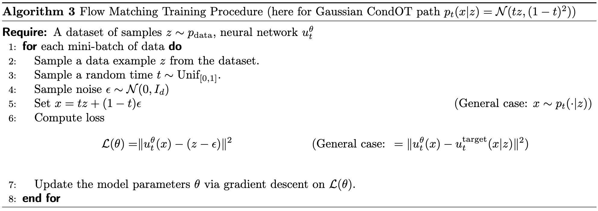
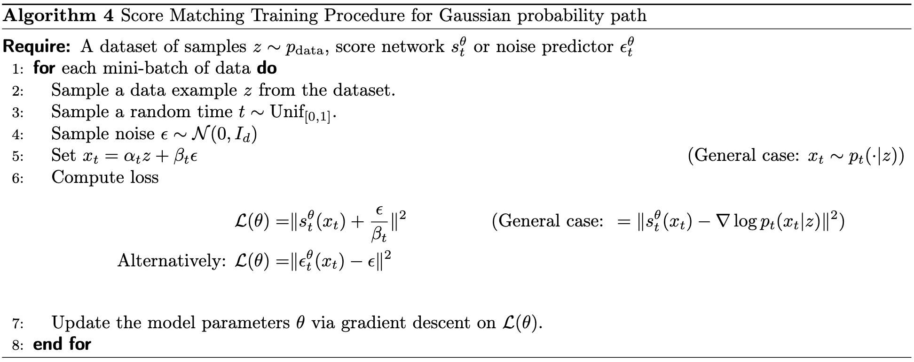

# Training Flow and Diffusion Models

!!! info "动机"

	在前两节中，我们展示了如何构建一个生成模型，其向量场 $u^\theta_t$ 由神经网络给出，并推导出了训练目标 $u^{\text{target}}_t$ 的公式。本节中，我们将说明如何训练神经网络 $u^\theta_t$ 来逼近训练目标 $u^{\text{target}}_t$。

## 流匹配 Flow Matching

首先，我们把问题限制在 ODE 的场景下推导出**流匹配（flow matching）**的方法。

一个流模型可以用以下方式给出：

$$
X_0 \sim p_{\text{init}}, \quad dX_t = u_t^{\theta}(X_t)dt
$$

机器学习的方法就是学习到参数 $\theta$，使得 $u_t^\theta\approx u_t^\text{target}$. 我们通常需要定义一个损失函数，在流匹配的语境下就是 flow matching loss. 一个直观的来获得 $u_t^\theta \approx u_t^{\text{target}}$ 的方法是使用均方误差（mean-squared error）。

!!! info "一些 Notations"

    - 我们用 $\text{Unif} = \text{Unif}[0,1]$ 表示区间 $[0, 1]$ 上的均匀分布，用 $\mathbb{E}$ 表示随机变量的期望值。
    - $p_t(x) = \int p_t(x|z) p_{\text{data}}(z) dz$ 在之前已经提过，是边际概率路径函数。

$$
\begin{align*}
\mathcal{L}_{\text{FM}}(\theta) &= \mathbb{E}_{t \sim \text{Unif}, x \sim p_t} [\|u_t^{\theta}(x) - u_t^{\text{target}}(x)\|^2] \\
&\stackrel{(i)}{=} \mathbb{E}_{t \sim \text{Unif}, z \sim p_{\text{data}}, x \sim p_t(\cdot|z)} [\|u_t^{\theta}(x) - u_t^{\text{target}}(x)\|^2],
\end{align*}
$$

我们可以这样感性地理解这个损失函数：首先，从区间 $[0, 1]$ 中随机采样一个时间 $t$；然后，从数据集中随机选择一个点 $z$，并从条件分布 $p_t(\cdot | z)$ 中采样（例如，通过添加一些噪声），并计算神经网络输出的 $u_t^\theta(x)$。最后，计算神经网络输出与边际向量场 $u_t^{\text{target}}(x)$ 之间的均方误差。

然后，很不幸的事情在于，$u_t^{\text{target}}(x)$ 过于复杂，导致我们无法用它来进行计算。**但是**，我们可以把它转化为条件向量场 $u_t^{\text{target}}(x|z)$，而后者是相对容易计算的。下面，我们给出一个新的损失函数。

$$
\mathcal{L}_{\text{CFM}}(\theta) = \mathbb{E}_{t \sim \text{Unif}, z \sim p_{\text{data}}, x \sim p_t(\cdot|z)} [\| u_t^{\theta}(x) - u_t^{\text{target}}(x|z) \|^2].
$$

这个新的损失函数能够帮助我们实现：通过显式地回归可处理的**条件向量场**，来隐式地回归难以处理的**边际向量场**。而这一点之所以能够成立，我们需要定理的支撑，下面我们给出这个定理。

!!! info "定理"

    边际流匹配损失（marginal flow matching loss）与条件流匹配损失（conditional flow matching loss）仅相差一个常数，即：

    $$
    \mathcal{L}_{FM}(\theta) = \mathcal{L}_{CFM}(\theta) + C
    $$

    其中 C 是一个与参数 $\theta$ 无关的常数。因此，它们的梯度是相同的：

    $$
    \nabla_{\theta}\mathcal{L}_{FM}(\theta)=\nabla_{\theta}\mathcal{L}_{CFM}(\theta)
    $$

    这意味着，通过随机梯度下降（SGD）等方法最小化 $\mathcal{L}_{CFM}(\theta)$，其效果等同于最小化 $\mathcal{L}_{FM}(\theta)$。特别地，对于 $\mathcal{L}_{CFM}(\theta)$ 的最优解 $\theta^{*}$，在模型具有无限表达能力的前提下，它将满足 $u_{t}^{\theta^{*}} = u_{t}^{target}$。

    我们在这里不给出定理的证明。

在理论基础完备之后，我们以高斯条件概率路径为例给出一个流匹配的例子。

我们已经多次给出了高斯概率路径的公式化描述：$p_t(\cdot|z) = \mathcal{N}(\alpha_t z; \beta_t^2 I_d)$。下面，我们给出一种从高斯概率路径采样 $x_t$ 的方法：

$$
\epsilon \sim \mathcal{N}(0, I_d) \quad \Rightarrow \quad x_t = \alpha_t z + \beta_t \epsilon \sim \mathcal{N}(\alpha_t z, \beta_t^2 I_d) = p_t(\cdot|z)
$$

??? warning "复习概率论！"

    P.S. 为什么这样采样成立呢？让我们来回顾一下概率论的知识吧😝
    这个采样方法其实就是利用了**高斯分布在仿射变换下的封闭性**——也就是说，对标准正态噪声做一次线性变换再加上偏移，得到的仍然是高斯分布，而且它的均值和协方差正好是我们想要的。

    我们先从标准多元正态分布中采样：$\epsilon \sim \mathcal{N}(0, I_d)$，然后对这个噪声做仿射变换：$x_t = \alpha_t\,z \;+\;\beta_t\,\epsilon$

    然后我们计算**均值与协方差**。由于 $\epsilon$ 的均值为 $0$，所以

    $$
    \mathbb{E}[x_t] = \alpha_t z + \beta_t \mathbb{E}[\epsilon] = \alpha_t z
    $$

    而 $\epsilon$ 的协方差矩阵是 $I_d$，仿射变换后，噪声部分的协方差变为

    $$
    \text{Cov}(\beta_t \epsilon) = \beta_t^2 \text{Cov}(\epsilon) = \beta_t^2 I_d
    $$

    偏移量 $\alpha_t z$ （在选择好特定的 data point 后，已经可以被视为一个常量，而常量不影响协方差计算）不影响协方差。

然后，我们也已经有了条件向量场的公式：

$$
u_t^{\text{target}}(x|z) = \left( \dot{\alpha}_t - \frac{\dot{\beta}_t}{\beta_t}\alpha_t \right) z + \frac{\dot{\beta}_t}{\beta_t}x
$$

把这些公式代入 $\mathcal{L}_{\text{cfm}}(\theta)$ 就能够得到：

$$
\begin{align*}
\mathcal{L}_{\text{CFM}}(\theta) &= \mathbb{E}_{t \sim \text{Unif}, z \sim p_{\text{data}}, x \sim \mathcal{N}(\alpha_t z, \beta_t^2 I_d)} \left[ \left\| u_t^{\theta}(x) - \left( \dot{\alpha}_t - \frac{\dot{\beta}_t}{\beta_t}\alpha_t \right)z - \frac{\dot{\beta}_t}{\beta_t}x \right\|^2 \right] \\
&= \mathbb{E}_{t \sim \text{Unif}, z \sim p_{\text{data}}, \epsilon \sim \mathcal{N}(0, I_d)} \left[ \left\| u_t^{\theta}(\alpha_t z + \beta_t\epsilon) - (\dot{\alpha}_t z + \dot{\beta}_t\epsilon) \right\|^2 \right]
\end{align*}
$$

特别地，如果我们令 $\alpha_t=t,\beta_t=1-t$，就可以得到一个更加简单的结果：

$$
\mathcal{L}_{\text{cfm}}(\theta) = \mathbb{E}_{t \sim \text{Unif}, z \sim p_{\text{data}}, \epsilon \sim \mathcal{N}(0, I_d)} \left[ \left\| u_t^{\theta}(tz + (1-t)\epsilon) - (z-\epsilon) \right\|^2 \right]
$$

很多的 SOTA 模型都是利用这个简单有效的公式训练出来的。

## 得分匹配 Score Matching

接下来，我们介绍**得分匹配（score matching）**将上面的方法扩展到 SDE。

我们再来回顾一下 ODE 是如何扩展到 SDE 的。

$$
\begin{align*}
    dX_t &= \left[ u_t^{\text{target}}(X_t) + \frac{\sigma_t^2}{2}\nabla \log p_t(X_t) \right] dt + \sigma_t dW_t \\
    X_0 &\sim p_{\text{init}}, \\
    \Rightarrow X_t &\sim p_t \quad (0 \le t \le 1)
\end{align*}
$$

上面，我们已经给出了训练 $u_t^{\text{target}}$ 的方法，那么剩下的问题就是要训练一个新的参数 $\nabla\log p_t$，我们可以用一个新的神经网络——得分网络 (score network) $s_t^\theta:\mathbb{R}^d\times[0,1]\rightarrow\mathbb{R}^d$ 来拟合它。同上，我们可以很类似地得到（条件）得分匹配的损失函数：

$$
\begin{align*}
\mathcal{L}_{\text{SM}}(\theta) &= \mathbb{E}_{t \sim \text{Unif}, z \sim p_{\text{data}}, x \sim p_t(\cdot|z)} [\|s_t^{\theta}(x) - \nabla \log p_t(x)\|^2] \quad \blacktriangleright \text{ score matching loss} \\
\mathcal{L}_{\text{CSM}}(\theta) &= \mathbb{E}_{t \sim \text{Unif}, z \sim p_{\text{data}}, x \sim p_t(\cdot|z)} [\|s_t^{\theta}(x) - \nabla \log p_t(x|z)\|^2] \quad \blacktriangleright \text{ conditional score matching loss}
\end{align*}
$$

同样十分类似地，我们可以直接用条件得分匹配来进行训练，原因也是因为这个很类似的定理：

$$
\mathcal{L}_{\text{SM}}(\theta) = \mathcal{L}_{\text{CSM}}(\theta) + C
$$

具体内容我们不再详细展开。

接下来，当我们完成了对两个神经网络的训练，只需要再选择一个去噪系数 (diffusion coefficient) $\sigma_t\geq0$，就能够模拟这个 SDE 了：

$$
X_0 \sim p_{\text{init}}, \quad dX_t = \left[ u_t^{\theta}(X_t) + \frac{\sigma_t^2}{2} s_t^{\theta}(X_t) \right] dt + \sigma_t dW_t
$$

理论上，如果我们的训练能够实现数据分布的完美拟合，任意的一个 $\sigma_t$ 都能够为我们生成 $X_1\sim p_\text{data}$. 但实际上，我们可能会遇到这样两种误差：

- **数值误差**：SDE 的模拟并不完美；
- **训练误差**：$u_t^\theta$ 不能和 target 百分百拟合。

因此，在实操时，我们通常依据经验挑选一个合适的去噪系数。

这个时候，有人可能会说，和 flow model 相比，diffusion model 需要一次训练两个参数，不是很麻烦吗？但事实上，我们通常把 $s_t^\theta, u_t^\theta$ 看做一个神经网络的两个输出，因此带来的额外计算开销是可以接受的。更进一步地，我们即将介绍 DDM，它直接解决了我们的这个问题。

## 去噪扩散模型 Denoising Diffusion Models

下面，我们考虑高斯概率路径的特殊情形，引出**去噪扩散模型（denoising diffusion models）。**

同样地，我们首先考虑高斯概率路径下的得分匹配是怎么样的，我们只需要把特定的 $\nabla\log p_t$ 代入损失函数即可：

$$
\nabla \log p_t(x|z) = - \frac{x - \alpha_t z}{\beta_t^2}
$$

$$
\begin{align*}
\mathcal{L}_{\text{CSM}}(\theta) &= \mathbb{E}_{t \sim \text{Unif}, z \sim p_{\text{data}}, x \sim p_t(\cdot|z)} \left[ \left\| s_t^{\theta}(x) + \frac{x - \alpha_t z}{\beta_t^2} \right\|^2 \right] \\
&= \mathbb{E}_{t \sim \text{Unif}, z \sim p_{\text{data}}, \epsilon \sim \mathcal{N}(0, I_d)} \left[ \left\| s_t^{\theta}(\alpha_t z + \beta_t \epsilon) + \frac{\epsilon}{\beta_t} \right\|^2 \right] \\
&= \mathbb{E}_{t \sim \text{Unif}, z \sim p_{\text{data}}, \epsilon \sim \mathcal{N}(0, I_d)} \left[ \frac{1}{\beta_t^2} \left\| \beta_t s_t^{\theta}(\alpha_t z + \beta_t \epsilon) + \epsilon \right\|^2 \right]
\end{align*}
$$

??? info "关于 DSM 的由来"

    由于网络 $s_t^\theta$ 实质上是在学习预测用于扰乱数据样本 $z$ 的噪声，因此，上述训练损失也被称为**去噪得分匹配（denoising score matching）**，它是最早用于训练扩散模型的方法之一。

但我们很快意识到，当 $\beta_t\approx0$ 时，这个 loss 会带来数值爆炸的问题（即 DSM 只在加入足够噪声的时候才 work）。因此在一些 DDM 的实现中（例如 **DDPM**, Denoising Diffusion Probabilitic Models），$\frac{1}{\beta_t^2}$ 这一项被丢弃，同时我们把 $s_t^\theta$ 改造成了一个新的神经网络（我们称为**噪声预测器**，noise predictor）$\epsilon_t^\theta:\mathbb{R}^d\times[0,1]\rightarrow\mathbb{R}^d$，然后就得到了如下结果：

$$
- \beta_t s_t^{\theta}(x) = \epsilon_t^{\theta}(x) \quad \Rightarrow \quad \mathcal{L}_{\text{DDPM}}(\theta) = \mathbb{E}_{t \sim \text{Unif}, z \sim p_{\text{data}}, \epsilon \sim \mathcal{N}(0, I_d)} [\| \epsilon_t^{\theta}(\alpha_t z + \beta_t \epsilon) - \epsilon \|^2]
$$

这个新的 loss 非常简单，**但更 magical 的点在于**，我们只需要训练 $s_t^\theta$ 或者 $\epsilon_t^\theta$ 就够了，因为 $u_t^\theta$ 可以用它推导出来，反之亦然。下面我们就来尝试说明这一点（当然了，这一点只在高斯概率路径的前提下成立）。

$$
\begin{align*}
u_t^{\text{target}}(x|z) &= \left( \dot{\alpha}_t - \frac{\dot{\beta}_t}{\beta_t}\alpha_t \right) z + \frac{\dot{\beta}_t}{\beta_t}x \\
&\stackrel{(i)}{=} \left( \beta_t^2\frac{\dot{\alpha}_t}{\alpha_t} - \dot{\beta}_t\beta_t \right) \left( \frac{\alpha_t z - x}{\beta_t^2} \right) + \frac{\dot{\alpha}_t}{\alpha_t}x \\
&= \left( \beta_t^2\frac{\dot{\alpha}_t}{\alpha_t} - \beta_t\dot{\beta}_t \right) \nabla \log p_t(x|z) + \frac{\dot{\alpha}_t}{\alpha_t}x
\end{align*}
$$

注意，$(i)$ 中的推导只需要数学变形就能得到，不需要额外的定理。对于边际向量场 $u_t^{\text{target}}(x)$，我们也有很类似的结论，在此不再推导。因此，我们有了如下**非常漂亮的结论**：

$$
u_t^{\theta} = \left( \beta_t^2 \frac{\dot{\alpha}_t}{\alpha_t} - \dot{\beta}_t \beta_t \right) s_t^{\theta}(x) + \frac{\dot{\alpha}_t}{\alpha_t}x
$$

即这两个参数可以通过线性变化之间转换（注意，当我们考虑这里的参数 $\theta$ 时，可以把 $t$ 和 $x$ 看做常量）。因此，**在高斯概率路径的情况下**（注意这个前提条件），我们只需要训练一个参数（任意选择 flow matching 或者 score matching 的方法），就可以实现 SDE 的采样。例如，我们只需要训练 $s_t^\theta$，就可以用如下方式来完成 sampling：

$$
X_0 \sim p_{\text{init}}, \quad dX_t = \left[ \left( \beta_t^2 \frac{\dot{\alpha}_t}{\alpha_t} - \dot{\beta}_t\beta_t + \frac{\sigma_t^2}{2} \right) s_t^{\theta}(x) + \frac{\dot{\alpha}_t}{\alpha_t}x \right] dt + \sigma_t dW_t
$$

## 如何阅读 Diffusion Model 的文献？

!!! info "声明"

	由于部分术语的中文翻译有些捉急/出戏，我们采用中英夹杂的方式来讲述这一部分的内容。

### 离散时间 vs 连续时间

早期的去噪扩散模型（DDPM），采用离散马尔可夫链，将时刻 $t$ 量化为整数：$0, 1, 2, …$。这种做法直观易懂，但存在两个主要缺点：

1. 在训练前必须**预先选定时间步数**及其离散方案。
2. 使用 ELBO（evidence lower bound）近似优化目标，该下界在离散情形下**并非严格等价于我们真正想最小化的损失**。

后来，我们发现，离散时间框架其实是对连续时间 SDE 的近似，而两者并没有本质意义上的不同。

我们是采用的 SDE 构造方法在数学意义上更加简洁。

### "正向过程" vs 概率路径

先说结论：**forward process 是构造（高斯）概率路径的特殊方式**。

它通常以 **inverted time convention** 的形式进行构造：

$$
\bar{X}_0 = z, \quad d\bar{X}_t = u_t^{\text{forw}}(\bar{X}_t)dt + \sigma_t^{\text{forw}}d\bar{W}_t
$$

它的大致想法是在一开始选取一个数据点 $z\sim p_\text{data}$，然后通过不断加噪声的方式来**”污染“**这个数据。而当 $T\rightarrow∞$，它的分布会趋近 $p_\text{data}$. 而这一想法和概率路径在本质上是一样的，唯一的区别是把路径反了过来，即变成了 $\bar{X}_0 = z$.

### 时间反转 vs Fokker-Planck 方程

我们有不同的构造 training target 的方式。在本文档的框架下，我们使用的是 Fokker-Planck equation (or Continuity equation) 的方式，但有其他方法是通过 **time-reversal** of the forward process 的方式来构造的。

### 流匹配与随机插值器

我们在这里介绍的理解 diffusion 的框架和 **flow matching & stochastic interpolants (SIs)** 的框架最为接近。

在 flow matching 中，我们不需要 forward process 和 SDE 就能实现流模型的训练，也因为这一点，从流模型中的采样是确定性的（即除了初始分布 $X_0\sim p_{\text{init}}$ 是随机的，其他都是确定的）。

而 stochastic interpolants 则同时包含了 pure flow 和 SDE extension (正如我们在上一节讲述的)。**这个框架相比扩散模型这一单一说法而言更简洁也更具普遍性**：我们可以实现从任意分布 $p_\text{init}$ 到任意分布 $p_\text{data}$ 的转换（而 denoising diffusion models 只能在高斯分布作为初始条件下才能 work）。
