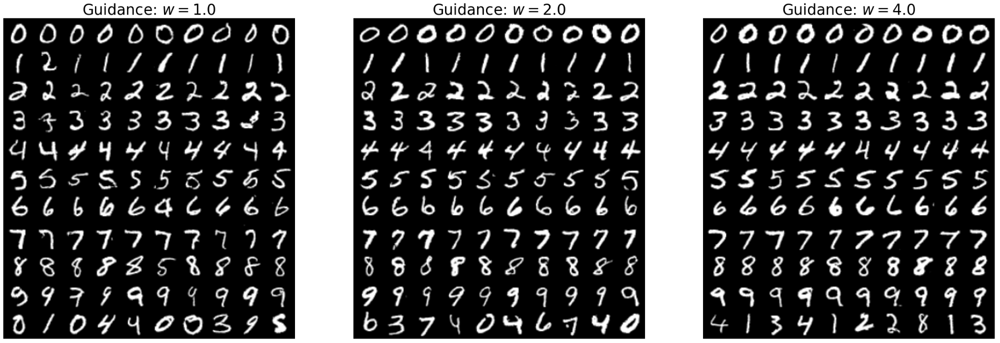
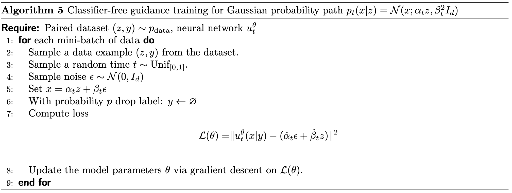
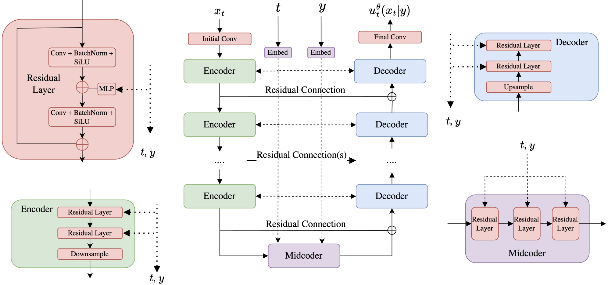
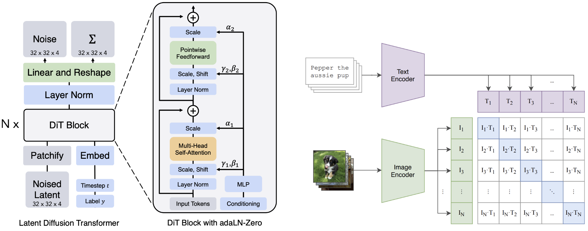

# Building an Image Generator

!!! info

    在之前的章节中，我们探讨了如何训练一个流匹配或扩散模型。接下来，我们将探讨如何使用这一框架来构建图像/视频生成器（例如 Stable Diffusion）。在这一建模过程中，我们主要需要解决如下两个问题：

    - 如何让我们生成的模型匹配特定的文本提示词，即实现条件生成（conditional generation）；
    - 如何让我们现有的目标以合适的方式来适配它。

## 引导 Guidance

到目前为止，我们的生成模型都是**无条件的** (unconditional)，即它会任意地生成一张图片。但我们期望它能生成关于特定内容的图片。形式化地来说，我们希望一个生成式模型输入一段文本提示词 $y$，它能够基于这个条件 $y$ 生成一张对应的图片 $x$，即我们希望从 $p_\text{data}(x|y)$ 中采样，让得到的数据分布根据 $y$ 发生变化。而对于 $y$ 来说，我们可以把它想象成一个新的分布空间 $\mathcal{Y}$，如果 $y$ 是一段文本，那么它可能来自某一连续空间 $\mathbb{R}^{d_y}$；如果 $y$ 是某一离散的类标签，那么它可能是像 $\mathcal{Y}=\{0, 1, 2, ..., 9\}$ 这样的离散集合。

!!! warning "关于 Guided 和 Conditional 的说明"

    由于在之前我们已经有了条件向量场的概念，为了区分，我们用“引导”一词来表示以 $y$ 为条件进行采样的动作。因此我们有了引导向量场 $u_t^\text{target}(x|y)$ 和条件向量场 $u_t^\text{target}(x|z)$。

为了实现引导向量 $y$ 的作用，我们需要修改现有的神经网络，为它添加一个新的参数，于是我们得到了引导向量场 $u_t^\theta(\cdot|y)$ 和一个与时间相关的去噪系数:

$$
\begin{align*}
\textbf{Neural network:}& \quad u^{\theta} : \mathbb{R}^d \times \mathcal{Y} \times [0,1] \to \mathbb{R}^d, \quad (x,y,t) \mapsto u_t^{\theta}(x|y) \\
\textbf{Fixed:}& \quad \sigma_t : [0,1] \to [0, \infty), \quad t \mapsto \sigma_t
\end{align*}
$$

于是，我们最终可以形成如下的采样流程：

$$
\begin{align*}
\textbf{Initialization:} & \quad X_0 \sim p_{\text{init}} && \quad \triangleright \text{ Initialize with simple distribution (such as a Gaussian)} \\
\textbf{Simulation:} & \quad dX_t = u_t^{\theta}(X_t|y)dt + \sigma_t dW_t && \quad \triangleright \text{ Simulate SDE from } t=0 \text{ to } t=1. \\
\textbf{Goal:} & \quad X_1 \sim p_{\text{data}}(\cdot|y) && \quad \triangleright \text{ Goal is for } X_1 \text{ to be distributed like } p_{\text{data}}(\cdot|y).
\end{align*}
$$

### 流模型

在流模型中，我们可以得到如下的 loss function：

$$
\mathcal{L}_{\text{CFM}}^{\text{guided}}(\theta) = \mathbb{E}_{(z,y) \sim p_{\text{data}}(z,y), t \sim \text{Unif}[0,1), x \sim p_t(\cdot|z)} \| u_t^{\theta}(x|y) - u_t^{\text{target}}(x|z) \|^2
$$

我们可以观察到，**除了数据的采样方式发生了变化，公式本身并没有发生变化**，下面我们对这一点进行解释。

!!! note "解释"

    我们可以想象，当我们固定了 $y$，并从 $p_\text{data}(x|y)$ 中进行采样，它只改变了**从数据集中进行采样的过程**，当数据确定，它并不会影响 $p_t(\cdot|z)$ 这一条件概率路径的分布。

    因此，我们可以换一个视角，把“基于引导进行采样”的动作看做从一个新的联合数据分布中进行采样的过程，即公式中的 $(z,y) \sim p_{\text{data}}$。从实践的角度，相当于实现一个 PyTorch 中的 dataloader，它同时返回 $z, y$。

接下来，我们要介绍**无分类器引导** (classifier-free guidance)。

尽管上述的训练方式在理论上可行，但在实际情况下，我们发现用这个方式训练出来的模型并不能生成与标签 $y$ 符合很好的图片。我们发现，当我们人工地增强 $y$ 的引导作用，模型的质量会有所提升。在现在的 SOTA 模型中，我们引入了**无分类器引导**的技术，接下来我们就来介绍这一方法。

之前我们已经讨论过在高斯概率路径的情况下，条件向量场 $u_t^{\text{target}}(x|y)$ 可以用如下公式直接书写出来（注意区别，之前是在 $z$ 的情况下，现在变成了 $y$）：

$$
u_t^{\text{target}}(x|y) = a_t x + b_t \nabla \log p_t(x|y)
$$

其中：

$$
(a_t, b_t) = \left( \frac{\dot{\alpha}_t}{\alpha_t}, \frac{\dot{\alpha}_t \beta_t^2 - \dot{\beta}_t \beta_t \alpha_t}{\alpha_t} \right)
$$

接下来，我们对这个公式应用贝叶斯公式，可以把引导分数重写如下：

$$
\begin{align*}
\nabla \log p_t(x|y) &= \nabla \log \left( \frac{p_t(x)p_t(y|x)}{p_t(y)} \right) \\
&= \nabla \log p_t(x) + \nabla \log p_t(y|x) - \nabla \log p_t(y) \\
&\stackrel{(i)}{=} \nabla \log p_t(x) + \nabla \log p_t(y|x)
\end{align*}
$$

在 conditional 的情况下，$y$ 可以看作向量，因此我们可以在 $(i)$ 中直接去掉关于 $y$ 的梯度项。于是，我们可以重写条件向量场公式：

$$
u_t^{\text{target}}(x|y) = a_t x + b_t(\nabla \log p_t(x) + \nabla \log p_t(y|x)) = u_t^{\text{target}}(x) + b_t \nabla \log p_t(y|x)
$$

这个公式可以被这样解读：它由**无引导的条件向量场**和**条件引导下的分数组成**。由于我们的经验结果发现引导 $y$ 的作用有待增强，因此我们可以通过放大后一项的作用来实现想要的效果：

$$
\tilde{u}_t(x|y) = u_t^{\text{target}}(x) + wb_t \nabla \log p_t(y|x)
$$

其中，$w\gt 1$ 是**引导缩放系数** (guidance scale)。这一经验公式在实践中可以获得比原来更好的效果。

!!! note "既然说分类器引导，那么分类器在哪里？"

    事实上，$\log p_t(y|x)$ 可以被看作是一个分类器：我们可以把每一个 $y$ 看作一个类别，当我们给定一个 $x$ (这里的 $x$ 就是噪声数据)，这个分数的计算结果就是把 $x$ 装入某个特定的 $y$ 的概率，即某种意义上的**”分类“**。

接下来，我们对上面的公式进行进一步的变形。我们再次应用如下变换：

$$
\nabla \log p_t(x|y) = \nabla \log p_t(x) + \nabla \log p_t(y|x)
$$

就可以把 $\tilde{u}_t(x|y)$ 变换如下：

$$
\begin{align*}
\tilde{u}_t(x|y) &= u_t^{\text{target}}(x) + wb_t \nabla \log p_t(y|x) \\
&= u_t^{\text{target}}(x) + wb_t(\nabla \log p_t(x|y) - \nabla \log p_t(x)) \\
&= u_t^{\text{target}}(x) - (wa_t x + wb_t \nabla \log p_t(x)) + (wa_t x + wb_t \nabla \log p_t(x|y)) \\
&= (1-w)u_t^{\text{target}}(x) + wu_t^{\text{target}}(x|y)
\end{align*}
$$

于是乎，我们有了理解 $\tilde{u}_t(x|y)$ 的全新视角——它是对无引导向量场 $u_t^{\text{target}}(x)$ 和引导向量场 $wu_t^{\text{target}}(x|y)$ 的**线性组合**。因此，我们只需要分别训练得到两个向量场就可以了。不过实际上，**我们并不需要分开训练两个模型**。我们可以在所有的标签 $y$ 之余设计一个新的标签 $\varnothing$，它的含义是**“无引导”**。这样一来，我们就可以得到 $u_t^{\text{target}}(x)=u_t^{\text{target}}(x|\varnothing)$ 然后把两个模型的训练统一起来。这种把有条件和无条件的模型以相同的形式训练的方式就被称为 **CFG** (classifier-free guidance).

!!! info "注意"

    值得说明的是，尽管我们在高斯概率路径的语境下推导除了这个公式，但是**它对任意概率路径都是成立的**。

接下来，我们说明 CFG 的模型应该如何进行训练。事实上，我们现在要解决的是 $y=\varnothing$ 在 $(z,y)\sim p_\text{data}$ 的采样下无法得到的问题。因此，我们的想法是以人工的方式引入让 $y$ 失效的概率，我们只需要引入一个新的超参数 $\eta$ 作为失效概率即可。于是，我们就可以得到 CFG 下的 loss function（事实上，和上面的 notation 只在采样的时候有这一个区别）：

$$
\begin{gather*}
\mathcal{L}_{\text{CFM}}^{\text{CFG}}(\theta) = \mathbb{E}_{\square}\| u_t^{\theta}(x|y) - u_t^{\text{target}}(x|z) \|^2 \\
\square = (z,y) \sim p_{\text{data}}(z,y), t \sim \text{Unif}[0,1), x \sim p_t(\cdot|z), \text{replace } y = \varnothing \text{ with prob. } \eta
\end{gather*}
$$

!!! note "总结一下！"

    上面，我们讲述了如何实现**无分类器引导的流模型** (Classifier-Free Guidance for Flow Models) 的训练和推理。

    训练过程：

    $$
    \begin{align*}
    (z,y) \sim p_{\text{data}}(z,y) & \quad \blacktriangleright \quad \text{Sample } (z,y) \text{ from data distribution.} \\
    t \sim \text{Unif}[0,1) & \quad \blacktriangleright \quad \text{Sample } t \text{ uniformly on } [0,1). \\
    x \sim p_t(x|z) & \quad \blacktriangleright \quad \text{Sample } x \text{ from the conditional probability path } p_t(x|z). \\
    \text{with prob. } \eta, y \leftarrow \varnothing & \quad \blacktriangleright \quad \text{Replace } y \text{ with } \varnothing \text{ with probability } \eta. \\
    \widehat{\mathcal{L}}_{\text{CFM}}^{\text{CFG}}(\theta) = \|u_t^{\theta}(x|y) - u_t^{\text{target}}(x|z)\|^2 & \quad \blacktriangleright \quad \text{Regress model against conditional vector field.}
    \end{align*}
    $$

    推理过程：

    $$
    \begin{align*}
    \textbf{Initialization:} \quad & X_0 \sim p_{\text{init}}(x) && \blacktriangleright \text{ Initialize with simple distribution (such as a Gaussian)} \\[2ex]
    \textbf{Simulation:} \quad & dX_t = \tilde{u}_t^{\theta}(X_t|y)dt && \blacktriangleright \text{ Simulate ODE from } t=0 \text{ to } t=1. \\[2ex]
    \textbf{Samples:} \quad & X_1 && \blacktriangleright \text{ Goal is for } X_1 \text{ to adhere to the guiding variable } y.
    \end{align*}
    $$

    注意到，在这种情况下，如果我们设置 $w\gt1$，$X_1$ 的分布并不完全和 $X_1\sim p_\text{data}(\cdot|y)$ 匹配。但是在实践中我们发现它能够和条件实现更好的对齐。

### 扩散模型

扩散模型相较流模型仅仅增加了一个分数项，它们在推导上十分类似，因此在这里我们仅给出 CFG 情况下的最后结论。

给定无引导边际分数 $\nabla \log p_t(x|\varnothing)$ 和引导边际分数 $\nabla \log p_t(x|y)$，我们可以定义无分类器引导的分数 如下：

$$
\tilde{s}_t(x|y) = (1-w)\nabla \log p_t(x|\varnothing) + w\nabla \log p_t(x|y)
$$

很类似地，我们可以把这两者用同一个神经网络 $s_t^\theta(x|y)$ 统一起来，并得到 CFG-CSM 的损失函数：

$$
\begin{gather*}
\mathcal{L}_{\text{CSM}}^{\text{CFG}}(\theta) = \mathbb{E}_{\square}\| s_t^{\theta}(x|(1-\xi)y + \xi\varnothing) - \nabla \log p_t(x|z) \|^2 \\
\square = (z,y) \sim p_{\text{data}}(z,y), t \sim \text{Unif}[0,1), x \sim p_t(\cdot|z), \text{replace } y = \varnothing \text{ with prob. } \eta
\end{gather*}
$$

而在推理过程中，我们需要分别定义如下两个向量场：

$$
\begin{align*}
\tilde{s}_t^{\theta}(x|y) &= (1-w)s_t^{\theta}(x|\varnothing) + w s_t^{\theta}(x|y), \\
\tilde{u}_t^{\theta}(x|y) &= (1-w)u_t^{\theta}(x|\varnothing) + w u_t^{\theta}(x|y).
\end{align*}
$$

推理过程：

$$
\begin{align*}
\textbf{Initialization:} \quad & X_0 \sim p_{\text{init}}(x) && \blacktriangleright \text{ Initialize with simple distribution (such as a Gaussian)} \\
\textbf{Simulation:} \quad & dX_t = \left[ \tilde{u}_t^{\theta}(X_t|y) + \frac{\sigma_t^2}{2} \tilde{s}_t^{\theta}(X_t|y) \right] dt + \sigma_t dW_t && \blacktriangleright \text{ Simulate SDE from } t=0 \text{ to } t=1. \\
\textbf{Samples:} \quad & X_1 && \blacktriangleright \text{ Goal is for } X_1 \text{ to adhere to the guiding variable } y.
\end{align*}
$$

## 神经网络架构

### U-Net

U-Net 是 CNN 的一种，它特别适合用于图像到图像的任务。

| 模块                      | 功能描述                                                     |
| ------------------------- | ------------------------------------------------------------ |
| **Encoder**               | 多层卷积 + 下采样（如 MaxPooling），提取逐层压缩的特征表示，保留语义信息； |
| **Bottleneck (Midcoder)** | 处理最紧凑的抽象特征表示，在此处嵌入时间 $t$ 和条件变量 $y$； |
| **Decoder**               | 多层卷积 + 上采样（如 UpConv 或插值），逐步恢复分辨率，实现图像重建； |

它还有一个重要特点是使用残差连接 (skip connections) 的机制，将 encoder 层的中间特征直接传递给 decoder 的相应层。由于编码路径会逐步丢失空间细节信息，这样的方式能将低层次的纹理信息保留下来，增强最终图像质量。

$$
\begin{align*}
x_t^{\text{input}} \in \mathbb{R}^{3 \times 256 \times 256} & \quad \blacktriangleright \quad \text{Input to the U-Net.} \\[2ex]
x_t^{\text{latent}} = \mathcal{E}(x_t^{\text{input}}) \in \mathbb{R}^{512 \times 32 \times 32} & \quad \blacktriangleright \quad \text{Pass through encoders to obtain latent.} \\[2ex]
x_t^{\text{latent}} = \mathcal{M}(x_t^{\text{latent}}) \in \mathbb{R}^{512 \times 32 \times 32} & \quad \blacktriangleright \quad \text{Pass latent through midcoder.} \\[2ex]
x_t^{\text{output}} = \mathcal{D}(x_t^{\text{latent}}) \in \mathbb{R}^{3 \times 256 \times 256} & \quad \blacktriangleright \quad \text{Pass through decoders to obtain output.}
\end{align*}
$$

### DiT

DiT 将输入图像分割成一系列不重叠的图块（patches）。然后将这些图块嵌入为向量，并由一个 Transformer 架构处理，该架构使用注意力机制来建模所有图块对之间的关系 。

在大规模生成任务中，一个普遍面临的问题是数据维度过高，导致显著的内存消耗。例如，若需生成一幅分辨率为 $1000 \times 1000$ 像素的图像，其维度将达到百万量级，极大增加了模型训练与采样的资源开销。为缓解这一问题，当前主流的方法是采用**潜空间建模**（latent space modeling），即将图像从原始像素空间压缩到一个低维潜空间中进行建模与采样。

具体而言，这一范式通常结合**流模型或扩散模型**与一个（变分）自编码器（(variational) autoencoder）使用。首先，通过预训练的自编码器将训练数据映射至潜空间，随后在该压缩表示上训练流模型或扩散模型。在生成阶段，模型先在潜空间中完成采样过程，再借助解码器将潜变量还原为完整的图像。

这种方法的核心优势在于：高质量的自编码器能够有效剔除语义无关或感知不敏感的图像细节，从而引导生成模型聚焦于关键的、高层次语义特征，提高建模效率与生成质量。由此构建的**潜空间扩散模型（latent diffusion models）**，已成为当前图像与视频生成领域中最主流的技术路线之一。

值得注意的是，该方法的性能不仅取决于扩散模型本身的表达能力，还高度依赖于自编码器的质量，尤其是在图像压缩与重建过程中是否能够保留足够的语义信息与感知质量。因此，在训练扩散模型之前，确保自编码器的充分训练与优化是关键前提。

### 编码 Guiding Variable

接下来，我们介绍如何把引导变量 $y$ 注入神经网络 $u_t^\theta(x|y)$ 的问题。总的来说，这个过程可以分为两个步骤：

- 将原始输入 $y_\text{raw}$ 转换为向量输入 $y$；
- 将这个向量注入到神经网络中。

首先是第一步。对于离散的类别标签，可以为每个类别学习一个嵌入向量 。而对于文本提示，通常使用强大的、预训练好的文本编码器模型，如 **CLIP（Contrastive Language-Image Pre-training）** 。这些模型擅长捕捉文本的语义信息 。

接下来，我们需要把这些信息注入网络中。一种方法是使用 point-wise 的方式将编码后的向量注入网络，例如：

$$
\begin{align*}
y &= \text{MLP}(y) \in \mathbb{R}^C && \quad \blacktriangleright \quad \text{Map } y \text{ from } \mathbb{R}^{d_y} \text{ to } \mathbb{R}^C. \\[2ex]
y &= \text{reshape}(y) \in \mathbb{R}^{C \times 1 \times 1} && \quad \blacktriangleright \quad \text{Reshape } y \text{ to "look" like an image.} \\[2ex]
x_t^{\text{intermediate}} &= \text{broadcast_add}(x_t^{\text{intermediate}}, y) \in \mathbb{R}^{C \times H \times W} && \quad \blacktriangleright \quad \text{Add } y \text{ to } x_t^{\text{intermediate}} \text{ pointwise.}
\end{align*}
$$

另外，还有例如 cross-attention 的方法应用于 DiT 中。
