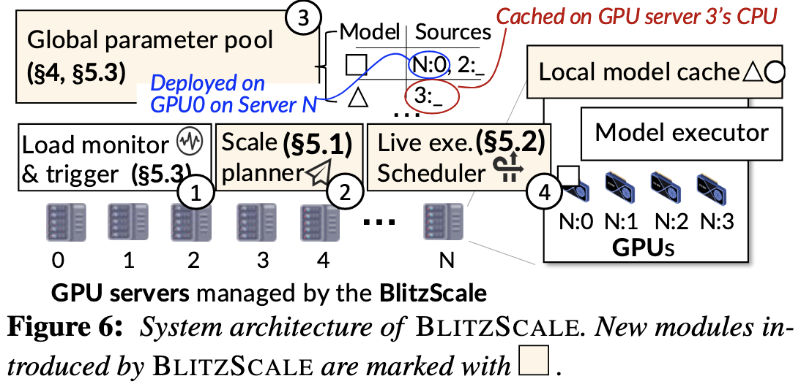

# BlitzScale: Fast and Live Large Model Autoscaling with O(1) Host Caching

> [论文](https://www.usenix.org/conference/osdi25/presentation/zhang-dingyan)
> SJTU IPADS

## 背景介绍

???+ note "关于云服务的一些指标"
    - **Tail latency**（尾部延迟）指系统在高并发场景下，**最慢的极少数请求**（如 P99/P999 分位）的延迟表现。它反映的是用户体验的下限，而非平均性能。
    - **Service Level Objective**（SLO，服务级别目标）是**服务可靠性工程**中的一个核心概念，它指的是：对某项服务在一段时间内所应达到性能或可用性的明确目标值。
    - **P99** 是 **“第 99 百分位数”（99th percentile）** 的简称。
    - MaaS 服务目标：最大化 goodput (符合 SLO 的请求数)；最小化预留的实例。

### MaaS

模型即服务 (Model-as-a-Service, MaaS)，是 Serverless 的一种，用户不必考虑服务器硬件资源等部署细节，而是以按量计费 (pay-as-you-go) 的方式获取模型服务，降低用户的推理成本，提高云上的资源利用率。

MaaS 和其他 Serverless 场景一样，难以同时实现**高服务性能和高效费比**。自动缩扩容 (Autoscaling) 可以动态伸缩模型服务实例，解决 over-provision 和 under-provision 的问题。

自动扩容的时间是减少 SLO violation 的关键，即 cold-start latency 是我们的核心优化目标。如果服务拉起速度太慢，当请求激增时，由于系统的 throughput 并没有上升，而请求的 queue time 上升，排队的请求在实例扩容完成前都不能被推理，从而违反了 SLO.

**扩容步骤**：创建 CUDA Context (control plane)；加载模型参数 (data plane)

{ width="400" style="display:block; margin:auto;"}

### SOTA 系统: ServerlessLLM

ServerlessLLM 将模型参数缓存在主机内存中，并优化**模型缓存缺失时本地 SSD 加载参数的速度**来提高模型的加载速度。

  - 由于多个模型在同一个集群中服务，为了尽可能地让每一个模型能 cache hit，就必须把每个模型缓存在每台 GPU 服务器上，带来资源浪费。
  - Cache miss 并不能因此避免，总有模型需要从 SSD 中进行加载。
  - 使用本地的 SSD 加载模型不仅速度慢，而且与云上分离式存储架构（如 NVMeof）相违背。

vLLM, DistServe 并不针对云上场景设计，没有 autoscale 的功能，只能通过 over-provision 的方式来满足 SLO. 这会带来 GPU Time 的浪费。

### 模型服务的特点

{ width="600" style="display:block; margin:auto;"}

需求未知，可能短时激增；内存使用也未知，可长可短。

Two-Phase，Prefill 阶段用 TTFT 衡量，Decode 阶段用 TBT 衡量。LLM Query 是 stateful 的，KVCache 在模型推理过程中会被存储在 GPU Memory 中。

KVCache 的大小很可能无法在一个 instance 内装下，需要解决可能带来的 OOM 问题。

## 问题与挑战

1. **Data Plane 的速度太慢**: 把模型参数加载入 GPU 的速度太慢。MaaS 的特点即模型参数量大，生成一个 token 就需要模型拥有全量的参数。

    > 例如，如果使用 SSD 从硬盘进行加载，每块 GPU 可以获得 2-10Gbps 的带宽，加载 Llamma3-8B 需要 8s.

2. **模型加载 stop-the-world**: 在参数加载完成之前，新的实例始终无法提供服务。

### 问题分析

{ width="600" style="display:block; margin:auto;"}

SLO 定义的是从用户发送请求到服务器返回推理响应的端到端延迟。可以看到，在 scale 过程中，后续请求的排队时间越来越长，导致 SLO 违例飙升。

Scale Time = SLO Time - TTFT Time, Bandwidth = Model Parameter Size / Scale Time

如果以 TP=4 传输一个 72B 的模型，根据 1250ms 的 SLO time 和 771ms 的 TTFT，要求网络带宽来到 576Gbps，SSD 显然做不到这一点。

{ width="400" style="display:block; margin:auto;"}

即使使用了 host cache，host 也不可能装下所有模型，因此不能完全避免缓存未命中带来的延迟。当 cache miss 时，模型加载速度就非常糟糕。同时，一个有意思的观察是，在 scale 的同时，由于负载被调度到了不同的 host，有更高概率带来 cache miss，从而导致 miss rate 飙升.

{ width="400" style="display:block; margin:auto;"}

Under-utilized 网络和高速的网络带宽给模型的加载带来更多可能性。即使在峰值下，网络的占用率也只有 60% 左右。集群中的高性能网络为我们提供了机会，RDMA 能提供 200Gbps 的带宽，与 PCIe 带宽接近。

### 问题 1

问题 1 要解决的是**模型服务实例的拉起速度**。

可能的解决方案：

- 现代 GPU 集群中有 NVLink, RDMA 等高速网络，而且在推理过程中没有很高的利用率，因此可以利用网络的 Multicast 快速拉起多个模型实例，满足自动缩扩容的需要，同时不会造成 over-provision 和 cache-miss 的问题。
- 利用高速网络的多播机制实现$O(1)$甚至$O(0)$缓存下的数据面加速。所有机器的内存加起来足够部署所有模型，因此$O(1)$的 cache 就能避免所有的 cache miss.
    - 但是 multicast plan 的生成并不简单，需要一个 planner 能够 online 地解决 NP-hard 问题并避免 scaling 和 serving 的实例之间的网络干扰。

- 实现 online interference-free scale plan generation，基于网络在线生成快速扩容方案
    - 用 online 的时间解决 NP-hard 问题。
    - 消除 loading 和 serving 的 workload 的网络干扰。

### 问题 2

问题 2 要解决的是 scale 过程中 throughput 仍然无法增加的问题。

- 通过细粒度的 scaling 抽象和合作执行，实现数据面的在线加载（layer-by-layer 的推理策略）。

    > 如果要加载 Qwen2.5-72B 并实现 500ms 的 stop time，则需要 576 Gbps 的带宽，目前的硬件无法实现。

- 使用 best-effort 的 scaling 无法实现负载均衡，因此我们需要考虑 future incoming layers，实现 zig-zag 的流水线调度。

可能的解决方案：用 zig-zag 的方法实现真正的 live autoscale，基于 zig-zag 调度实现高效快速扩容。从 throughput 的角度理解为什么这个方法有可能 work：假设一个 7-layer 模型，原来的 throughput 是 $1/7$，在加载了一个 layer 之后，throughput 来到了 $1/6$。

{ width="600" style="display:block; margin:auto;"}

## 系统设计

### 系统架构

24k 行 Rust 和 C++ 代码，实现 PD 分离和 continuous batching 等技术。

{ width="400" style="display:block; margin:auto;"}

- Global Parameter Manager 管理在 GPU 上部署的模型和在 CPU 上 cache 的模型，实现 model 和 source 的映射。
- Load Monitor 负责监控负载。
- Scale Planner 负责生成 online 的方案。
- Execution Scheduler 负责请求调度和重定向。

### 网络拓扑

{ width="400" style="display:block; margin:auto;"}

问题建模：

- NVLink 有 1600-3600Gbps 的带宽，因此用 NVLink 互联的组内的通信时间可以忽略。
- 忽略二级以上交换机，采用 leaf-spine 结构。每个 GPU 与一台叶子交换机相连，拥有 $BW_i$ 的带宽；叶子交换机内的通信是 full-mesh 的。
- 叶子交换机之间（即跨交换机）的通信小于等于交换机内部的，采用 VLT 等网络技术屏蔽更复杂的拓扑结构。

### 线性转发链 Serial Forwarding Chain

- Data Center 中存在 scale-up (如 NVLink) 和 scale-out (如 RDMA)，拓扑结构复杂，在异构网络中获取最优的多播 (multicast) 方案是一个 NP-hard 问题。在服务的过程中，用户的流量和 GPU 的分配也是动态变化的，因此需要生成在线扩容方案。

> 在 PD 分离的场景下，朴素的扩容方式会因流量竞争而产生网络干扰，而利用网络硬件双向的特性可以规避这个干扰。如果产生流量竞争，在实验上它会带来 1.5 倍的扩容时间和 50% 的 TBT Tail Latency.

    
    

???+ "**串行转发的多播机制**"
    **串行转发的多播机制**（serial forwarding multicast）能加载大量数据（如模型参数），而且无论接收者数量是多少，效率几乎不变。数据从源节点出发，一跳跳往下传播（像链条），或利用树状结构传播，形成类似“级联转发”。

    多播是一种网络传输方式，介于广播（broadcast）和单播（unicast）之间：

    - **单播**：一个源发送一份数据给一个接收者（N 个接收者要发 N 次）
    - **广播**：一个源发数据给网络中**所有节点**（不管你要不要）
    - **多播**：一个源发数据给**特定一组接收者**
      多播通过 **组播地址（multicast address）** 和 **组播组（multicast group）** 来实现有选择性的广播。
    - 串行的广播链路 $S\rightarrow T_1\rightarrow T_2 \rightarrow ... \rightarrow T_n$ 有很好的性质，在 bandwidth-intensive 的场景下，整体的传输时间和 scale 的模型个数无关。
    - serial-chain 是必要的，但是 multi-chain 更好（因为 inter-leaf 的通信可能差异很大），它有一定可能**避免 inter-leaf 的通信**，同时让** PD 分离场景下的干扰更少**。

    { width="400" style="display:block; margin:auto;"}

**算法设计的 insights：**

1. prune 掉 serving 的实例，减少干扰（load 可以来自 host memory 和 GPU instances）；
2. 把 NVLink 互联的卡作为一个逻辑组，从方案中省略 NVLink，从而降低了复杂度；
3. 尽量选择同一个 leaf 交换机下的节点进行传输，可以更大程度地保障带宽；
4. 链中的节点顺序非常重要（从网络中加载模型参数是 band-intensive 的）。用贪心的方式从高带宽到低带宽，算法按照节点间链路速度的降序进行排序，向具有更高带宽的节点发送数据可以更快地提升（系统的）服务吞吐量；
   { width="400" style="display:block; margin:auto;"}
5. 双向的 RDMA 下，incast 和 outcast 流量互不干扰，在同一条链路上避免同向的数据流动。（例如从 decode instance 传送参数到 prefill instance）

{ width="300" style="display:block; margin:auto;"}

### 模型分片聚合 Sharded Parameter Transfer

- 利用 scale-up 网络和 scale-out 网络的带宽差异，在分发参数的过程中，可以采用分片分发的方式，即从不同的 src 节点分别分发模型的一部分，聚合网络带宽；再利用卡间 scale-up 网络的 NVLink 带宽完成 All-gather 操作，从而加快模型参数传递速度。

{ width="300" style="display:block; margin:auto;"}

### Zigzag 调度

- 在扩容过程中，**新分配的 GPU 可以为系统提供算力**，从而解决新分配的 GPU 在模型参数尚未加载完成的时候无法生成 token 的问题。
- 已经加载到服务器上的模型拥有全量参数，可以在请求激增的时候将新的请求路由到新分配的 GPU 上推理若干层，再路由回老的 GPU 上推理剩余层。

调度的时机：

- 当 scale 会破坏 SLO：profile 加载速度和 SLO 之间的关系
- 找到一个 overloaded instance，通常和第一条呼应，这个时候我们通常挑选在广播链 tail 位置的 instance，因为它的带宽最低.

**方案 1**:

$$\text{Latency}_\text{avg} = \left( \sum_{req=1}^{N} \sum_{i=1}^{req} S_{i} \right) / N$$

$$
\begin{aligned}
\min \quad & \text{Latency}_{\text{avg}} \\
\text{s.t.} \quad & S_i + T_i = L, \quad \forall i \quad \text{Pipeline limit (C1)}, \\
& \sum_{j=1}^{i} T_j \le \sum_{j=1}^{i-1} S_j, \quad \forall i > 1 \quad \text{Pipeline dependency (C2)}, \\
& \text{Time}_i * T_i \le \sum_{j=1}^{i-1} T_j + (N - i + 1) \times (T_i - 1), \\
& \forall i > 1 \quad \text{Load limit (C3)}
\end{aligned}
$$

求解一个 ILP 线性约束。

**方案 2**:

{ width="400" style="display:block; margin:auto;"}

尽可能地让新的 request 在新的 instance 上运行更多的时间。

优先级如何定义？遵循 FCFS 的原则；同时有加载的 layer 还没有被执行。

### 全局参数池和 scale 策略

初始化时完成对模型参数的均匀 1 拷贝。

通过 tokens per second 和 KVCache 使用率来观测集群负载。

### 关于 LLM

在 PD 分离的场景下，一个 layer 的 prefill 和 decode 时间基本和 batched token size 成正比，因此在计算 ILP 的时候需要为每个 batch 加一个正则化参数。而在 decoding 阶段，AR 下无法预测 token size 大小，因此只能使用 ILP-free scheduling。（这里，在 decoding 阶段 scaling 的同时也需要考虑 KVCache 的问题）

在 scale decode 实例的时候，由于 KVCache Transfer 和 parameter loading 都来自 incast 带宽，不可避免带来干扰。因此目前的策略是先把一部分 prefill 实例转换为 decode 实例，再 scale prefill 实例。

当我们发现 scale prefill 实例是必要的时候，可以同步 scale decode 实例，这样就可以 overlap 掉这一部分开销。（分析 prefill 和 decode 进行 scale 的时间差）

## Evaluation

### TestBed

{ width="400" style="display:block; margin:auto;"}

### Baseline

- ServerlessLLM (S-LLM and Optimal AllCache)
- Distserve
- vLLM

### TTFT 和 TBT

BlitzScale 在 TTFT 上的优化显著优于 TBT。

1. Decoding 可以被 pre-scaled，即当 prefill 的 throughput 增加，decode instance 就会直接 auto-scale，这部分时间和 prefill 时间重叠。
2. Decode 可以被 scale 的更少，因为这个阶段是 memory-bound 的，在目前的优化下可以实现 no queueing time, slightly increased TBT.
3. 在不同的工作负载下，对于 S-LLM，第一次 burst 时会带来大量 cache miss，但是后续的 burst 就可以实现 cache hit（corner case 需要考虑两次 burst 的间隔大于 eviction time）

### 性能与资源使用

{ width="600" style="display:block; margin:auto;"}

在相同的 GPU Time 下获得更好的性能。Over-provision 能带来最好的表现但是会浪费 GPU 时间。

{ width="300" style="display:block; margin:auto;"}

ServerlessLLM 的 memory 占用和 host 数成正比，因此一个模型会迅速地污染服务器的 memory.

{ width="300" style="display:block; margin:auto;"}

这一段话很好地解释了 scale 的常用配置。

> BLITZSCALE utilizes two broadcast chains (each involving 3 instances), while the end instances involve a live autoscale. The start instances are the decode instances. For AllCache, it directly loads the parameters from the host memory of the scaled instances.
> Second, BLITZSCALE can scale faster even compared with AllCache, thanks to our NVLink-based fused link transmission protocol: it can finish scaling in 1,200 ms while AllCache takes about 2,000 ms.

{ width="600" style="display:block; margin:auto;"}

消融实验：网络越差，live scale 的效果越好。decode 通常不需要 scale.

{ width="400" style="display:block; margin:auto;"}

网络带宽的 overhead 几乎可以忽略。

{ width="300" style="display:block; margin:auto;"}

在足够的优化下，control plane 的 overhead 可以极大地降低。

## Related Work

- Orca: continuous batching
    - Iterative-level scheduling: 不同于以前以 batch 作为完整单位进行推理，当 batch 内有一个 request 已经完成推理，它必须通过 zero-padding 的方式等待其他所有请求完成；现在在一次迭代中调度一次，解决了这个问题。
    - Selective batching: 针对 Attention 等无法 batch 的操作，我们以 request 为单位进行处理；但对其他位置无关的操作，我们可以用 flatten 和 reshape 操作实现 batchify.

- DistServe
    - 将 prefill 和 decode 解耦，将相同 layer 所属的 GPU 放在同一台机器内，减少 KVCache 迁移的 overhead

- LoongServe
    - 面对 long context 的场景，单张 GPU 无法存下 KVCache，SP 成为必要的分布式手段。同时，不同 request 和不同 phase 之间的差距可能会很大，例如不同的上下文导致 prefill 阶段的负载波动很大。因此，实现 elastic 的并行也是十分重要的。
    - 提出 ESP 方法，把 SP 扩展到推理阶段。使用 proactive migration 降低了从 prefill 到 decode 阶段 KVCache 迁移的开销。使用 multiple master instance 的方法实现 decode 阶段的负载均衡。设计了 online 的缩扩容算法。

- ServerlessLLM
    - 设计了 multi-tier caching system，把模型参数加载到 CPU DRAM 中进行数据面加速。如果 cache hit，可以利用 CPU-GPU PCIe 带宽加载模型。
    - 但不总是能直接加载。如果 cache-hit 但是 GPU 已经被占用，则需要把现有负载迁移到其他机器上；如果 cache miss 了，则需要从 SSD 当中加载模型。

- DeepServe
    - 微服务架构（还可以拉上 mooncake 谈一谈）

- 并行策略
    - DeepSeek 实现 DP + EP 的并行策略。（All2All 让进出通信量保持不变）但是这也对 reliability 的要求非常高。另外实例内的 scale（和这篇文章 concern 的问题也非常相关）也非常的难，对于一个同步通信，卡数越多就会带来通信效率和稳定性的挑战。波动流量下的负载均衡带来更大的挑战。
