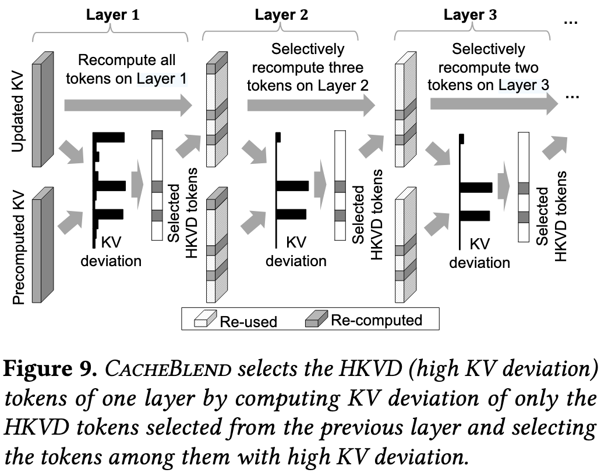

# CacheBlend: Fast Large Language Model Serving for RAG with Cached Knowledge Fusion

> [论文](https://dl.acm.org/doi/10.1145/3689031.3696098)  [开源项目](https://github.com/LMCache/LMCache)  From UChicago, EuroSys'25 Best Paper

## 背景

RAG 场景有如下特点：

- 以 text chunks 为单位，每轮对话中可能用到多个文本块；
- 数据库包含大量文本块，且有冷热分布。

现有的 KVCache 复用机制下，我们实现了 Prefix Caching，即要求**前缀完全匹配**才能复用。而 CacheBlend 尝试解决下面的问题：即使 KVCache 不满足前缀匹配，我们只需要选择性地重新计算少量 KVCache 就能实现复用，从而优化 prefill 阶段的计算速度。

## 挑战

{ width="40%" style="display:block; margin:auto;"}

现有的解决方案有以下几种：

- full-recompute：在每轮对话中都重新计算 KVCache；
- full-reuse: 不管前缀匹配的要求，直接复用已经计算好的 KVCache；
- prefix-cache: 仅复用满足前缀匹配的部分，其余部分皆重新计算。

全部复用一定是最理想的，但它会带来如下问题：

1. **KV Cache 的位置编码错误**：RAG 拼接文本块时是有顺序的，在进行 Attention 计算时，我们会基于 token 的位置对 Q 和 K 进行位置编码，这个顺序不能直接打破。这意味着即使 token 相同，只要位置编码不同，Q/K 也是不同的。
2. **文本块之间的交叉注意力（cross-attention）缺失**：在原始的 prefill 计算当中，后面文本块中的 token 会注意到前面文本块中的 token（Causal Attention）。可是如果在一个请求中，后面的文本块并没有注意到前面的文本块（即没有计算 attention score），则会导致回答精度下降。

{ width="50%" style="display:block; margin:auto;"}

## 方案

为了解决上述问题，CacheBlend 提出了如下两个部分的方案：

1. 用正确的方式拼接不同文本块的 KVCache；
2. 挑选一部分 KVCache 进行重计算。

首先，我们找到一系列文本块，然后利用 RoPE 位置编码的特性，校正 K Cache 的位置编码。不同于在 embedding 层的绝对位置编码，RoPE 只关注每个 token 的单独位置并在 Q 和 K 上作用一个旋转矩阵，即把在第 n 个位置上的 K 旋转 $n\theta$ 角度。这个操作只需要进行一次，因此它的开销可以忽略不计。在计算位置编码之后，我们把这些 KVCache 拼接就可以得到 pre-computed KVCache.

接下来，我们选择部分 KV 进行重算。文中提出了 KV deviation 和 Attention deviation，分别为与真实值（即全部重新计算）的绝对误差和 L-2 范数。当我们充分利用 **Attention 矩阵的稀疏性**和**相邻层之间的相似性**，就可以通过少量重计算的方式得到较高的精度。

???+ warning "注意"

    值得注意的是，重计算的开销与重计算的 token 数是成比例的，为线性关系。

{ width="40%" style="display:block; margin:auto;"}

{ width="40%" style="display:block; margin:auto;"}

那么，我们如何选择这些 token 呢？文中给出了两个关键的 insight：

1. 在第 $i$ 层，对 KV deviation 更高的 token 进行 recompute 能更显著地减小 attention deviation；
2. 有更大 KV deviation 的 token 在层间有较大相似性。

因此，具体的做法为：首先完整计算 layer 1 的所有 KV，根据 KV deviation 挑选前 $r\%$ 的 token 进行重计算，并把这些 token 延续到接下来的层上。值得注意的是，这一 likelihood 并不完全成立，因此需要采用**渐进式过滤**的方法，即刚开始选择的 $r_1$ 略高于 $r$，随着 layer 慢慢减小。

{ width="50%" style="display:block; margin:auto;"}

???+ warning "关于 layer 1"

    需要注意，事实上，layer 1 的 KV 并没有进行位置编码和 cross-attention，因此其计算结果和初始值没有区别。

## 系统设计

{ width="90%" style="display:block; margin:auto;"}

{ width="60%" style="display:block; margin:auto;"}

在系统设计上，如果重计算的速度比搬运 KV 的速度更快，**我们就可以用 pipeline 的方式** layer-by-layer 地加载 KV，从而隐藏 recompute 的开销。

在具体实现中，我们实现如下组件：

- Loading Controller：基于存储设备选择合适的 $r\%$；基于需求选择合适的存储设备；
- KV Cache Store：对 KV 存储进行管理。
