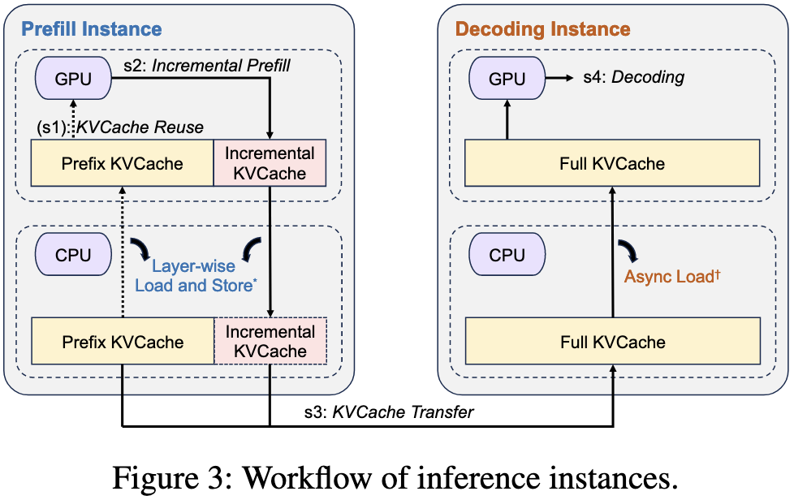
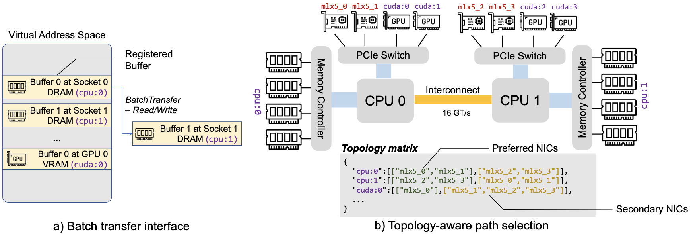
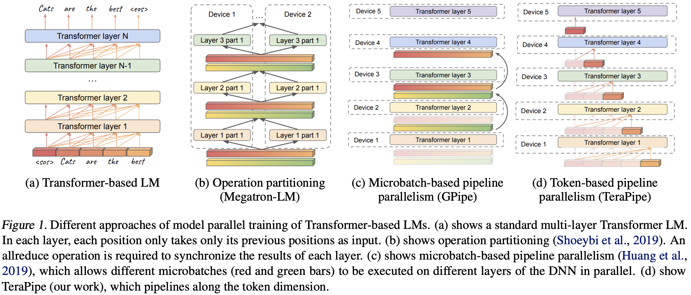
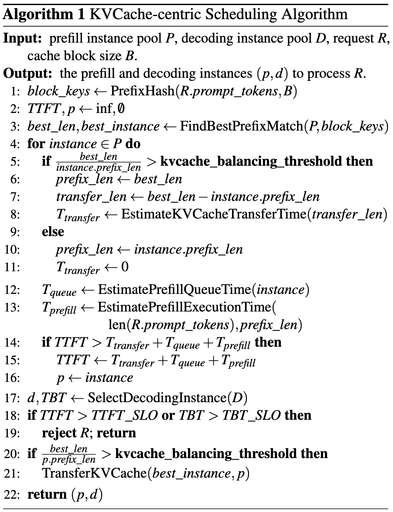

# Mooncake: Trading More Storage for Less Computation

> A **KVCache-centric** Architecture for Serving LLM Chatbot
>
> [论文](https://www.usenix.org/system/files/fast25-qin.pdf) From Moonshot, FAST'25 Best Paper

{ width="80%" style="display:block; margin:auto;" }

## 问题建模

本文的核心 insight 为：在 KVCache-centric 系统中**以存换算**。

首先，我们来复习一下 KVCache 复用，如下的公式很好地说明了这一点：如果当前请求的长度为 $n$，且有长度为 $p$ 的前缀可以复用，那么——

$$
\begin{aligned}
q[p:n], k[p:n], v[p:n] &= \text{MLP}(\text{hidden}[p:n]) \\
k[1:n], v[1:n] &\leftarrow \text{KVCache} + (k[p:n], v[p:n]) \\
o[p:n] &= \text{Attention}(q[p:n], k[1:n], v[1:n]) \\
\text{KVCache} &\leftarrow (k[1:n], v[1:n])
\end{aligned}
$$

如果我们希望 KVCache 有效（即优化 TTFT，同时减少 GPU Time），则要求存取速度大于计算速度。下面是对这个问题的建模。

首先，当给定输入长度 $n$，prefill 阶段的 FLOPS 可以计算如下：

$$
flops(n)=l\times (an^2d+bnd^2)
$$

因此，对于 $p$ 的前缀，可节省的运算量为 $l\times (ap^2d+bpd^2)$。而另一方面，把 KVCache 搬运到 GPU 的 HBM 中的大小为 $p\times l \times (2\times d/gqa)\times s$。当我们假设计算吞吐量 $G$ 和 KVCache 加载速度 $B$，就可以得到如下公式：

$$
\frac{B}{G} > \frac{2ds}{gqa \times (apd + bd^2)}
$$

## 系统设计

{ width="60%" style="display:block; margin:auto;" }

可以看到，Mooncake 的推理过程分为下面几个部分：

1. **KVCache Reuse：**从远端的 CPU Memory 加载 KVCache 到 GPU Memory，需要做到尽可能多地复用、平衡不同 prefill 节点的工作负载、保证 TTFT SLO；
2. **Incremental Prefill：**使用 prefix caching 完成 prefill 阶段，把新的 KVCache 存回 CPU Memory 中，如果 token 数过多，prefill 阶段会被切分为多个 chunk 并采用 pipeline 的方式并行；
3. **KVCache Transfer：**把 KVCache 从 prefill 节点传输到 decode 节点；
4. **Decoding：**采用 continuous batching 执行 decode 阶段。

### Mooncake Store

采用 Topology-aware path selection.

{ width="80%" style="display:block; margin:auto;" }

### Mooncake Prefill Pool

Chunked prefill 和 P/D 分离一直是一个争议话题。前者模糊了 P/D 两个阶段的界限，而后者充分考虑 P/D 阶段的不同特点采用分离的方式部署。考虑到 prefill 阶段可能和不同的并行策略组合起来（例如 TP、SP 来应对长文本的场景），最终还是采用了 P/D 分离的结构（其实是把 P/D 分离到底）。

在不同的并行策略中，使用 TP 会在每一层都带来两次 RDMA-based all-reduce 操作，使 prefill 阶段的 MFU 下降；SP 可行，但在短文本场景下可能反而使速度下降（有 elastic 的方案但是会提升系统的复杂度），同时频繁的跨节点通信可能与 KVCache 传输的网络相冲突。

最终，模型采用了 CPP (chunked pipeline parrallelism) 来应对长文本场景。

???+ note "关于 CPP"

    CPP 本质上是 TeraPipe 的 forward 版本。首先来说一下它的好处，它只需要在每个 pipeline stage 进行一次跨节点通信，可以和计算 overlap 起来；另外它天然地适合长、短文本等不同场景。

    一篇关于 TeraPipe 的分析文章 [让Pipeline在Transformer LM上沿着Token level并行起来——TeraPipe](https://zhuanlan.zhihu.com/p/497358208)

    

    - 把模型按不同的 layer 放在不同的 device 上，每一个 token 需要在所有 device 上流动一遍，前后 token 的计算可以在同一个 device 上 pipeline 起来。
    - 在 sequence-level 上不能均匀切分，因为越后面的 token 计算量越大，因此我们要用 DP 让每个 batch 的计算时间大致相当。

## 调度

{ width="50%" style="display:block; margin:auto;" }

Mooncake 的调度器（Conductor）有两个核心目标：

1. **Prefill 阶段：最大化 KVCache 复用率**。尽可能复用已有 KVCache，减少重复计算；保证 TTFT 满足 SLO；避免 prefill 负载过高拖慢后续 decoding。
2. **Decoding 阶段：最大化吞吐量（MFU）**。通过 **continuous batching** 聚合更多 token，提高模型 FLOPs 利用率；保证 TBT 满足 SLO；受 VRAM 容量限制（因为 decoding KVCache 必须驻留 GPU 显存）。

Mooncake 的 prefill 调度不仅考虑负载，还引入了 **prefix cache 命中长度**与 **KVCache 分布**。对每个新请求：

1. 计算其 **prefix 匹配长度**（即 KVCache 可复用的部分）。
2. 估算每个 prefill 实例的执行时间：$TTFT_i=T_\text{transfer}+T_\text{queue}+T_\text{prefill}$
3. 选择 TTFT 最短的实例，如果无法满足 SLO，则拒绝请求（HTTP 429）。
4. 必要时触发 **KVCache 迁移**，将热点块复制到新实例。

**预测模型**：

- Prefill 计算时间：通过 **多项式回归模型** 预先训练，输入为请求长度与命中长度。
- 排队时间：累加队列中已知请求的 prefill 时间。

  **Cache 负载均衡：** KVCache 的访问模式很不均匀。Mooncake 采用**启发式热点迁移 (Hotspot Migration)**。监控热点块访问频率，动态增加副本数量；当某请求命中远程缓存且迁移成本低于计算成本时，主动迁移；当命中长度不足阈值时（`kvcache_balancing_threshold`），优先重新计算而非迁移。
